# Work Day with God

**A completely free daily devotional app for Christians.**

Work Day with God is a peaceful Windows, Android, and iOS companion created to help Christians pause, read Scripture, reflect, and pray throughout the working day.

**[Download Windows 1.4.9](https://github.com/mcographics/WorkDaywithGod/releases/latest)** · **[Download Android 1.0.4](https://github.com/mcographics/WorkDaywithGod/releases/tag/android-v1.0.4)** · **[Linux 1.2.2 testing preview](https://github.com/mcographics/WorkDaywithGod/releases/tag/v1.2.2-linux-beta.1)** · **[Discord support](https://discord.gg/2UvdpY4JSW)** · **[Changelog](CHANGELOG.md)** · **[Security policy](SECURITY.md)**

Each calendar day presents a Bible verse, an original devotional reflection, a practical question, a short prayer, and a scenic background. Gentle reminders can be scheduled around your day through Windows, native Android notifications, or native iOS notifications.

There are no subscriptions, advertisements, accounts, or paid features. The app is completely free to download and use.

## Current platform status

| Platform | Current version | Release status | Download | Source line |
| --- | --- | --- | --- | --- |
| Windows x64 | 1.4.9 | Stable | [Windows release](https://github.com/mcographics/WorkDaywithGod/releases/tag/v1.4.9) | [`main`](https://github.com/mcographics/WorkDaywithGod/tree/main) |
| Android 7.0+ | 1.0.4 | Stable GitHub APK | [Android release](https://github.com/mcographics/WorkDaywithGod/releases/tag/android-v1.0.4) | [`android-v1.0.4`](https://github.com/mcographics/WorkDaywithGod/tree/android-v1.0.4) |
| iOS 15+ | 1.0.0 | Native project ready; not yet released | Requires Xcode signing | [`main`](https://github.com/mcographics/WorkDaywithGod/tree/main) |
| Linux x64 | 1.2.2 | Testing prerelease | [Linux testing preview](https://github.com/mcographics/WorkDaywithGod/releases/tag/v1.2.2-linux-beta.1) | [`linux-v1.2.2-testing`](https://github.com/mcographics/WorkDaywithGod/tree/linux-v1.2.2-testing) |

## Application preview

The gallery below shows **Work Day with God 1.4.4 for Windows**. Phone screenshots are included in the [Android app preview](#android-app-preview).

<table>
  <tr>
    <td width="50%" align="center"><strong>Daily Verse Card</strong></td>
    <td width="50%" align="center"><strong>Expanded Devotional Reader</strong></td>
  </tr>
  <tr>
    <td align="center">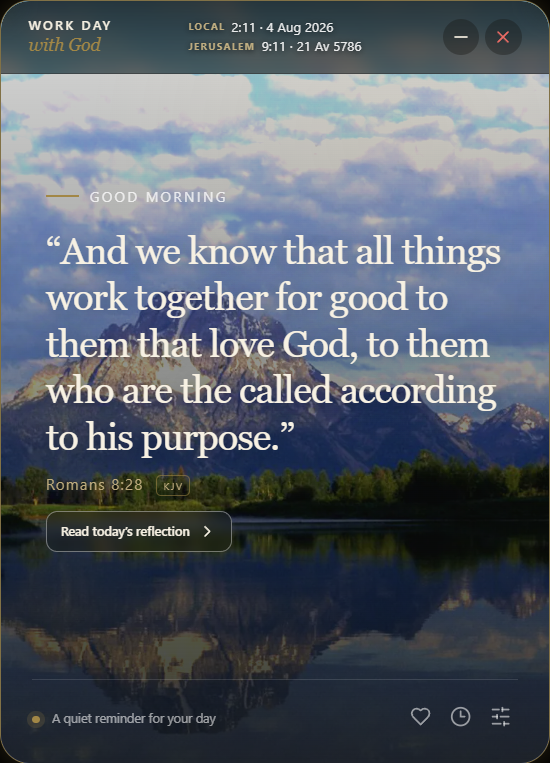</td>
    <td align="center">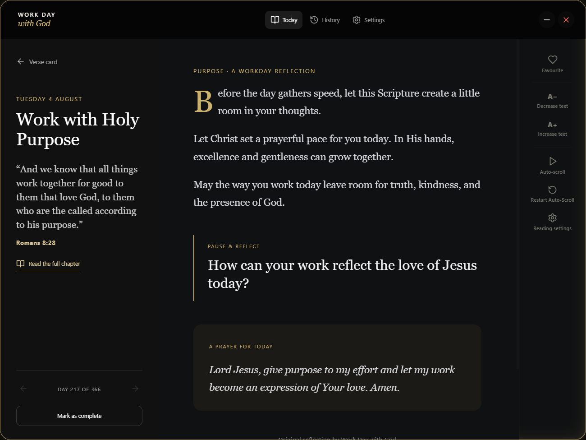</td>
  </tr>
  <tr>
    <td align="center"><strong>Reading History</strong></td>
    <td align="center"><strong>Settings Overview</strong></td>
  </tr>
  <tr>
    <td align="center">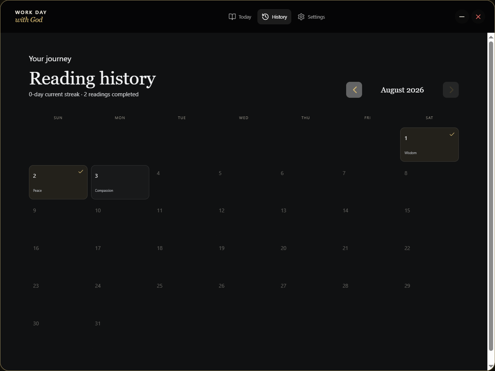</td>
    <td align="center">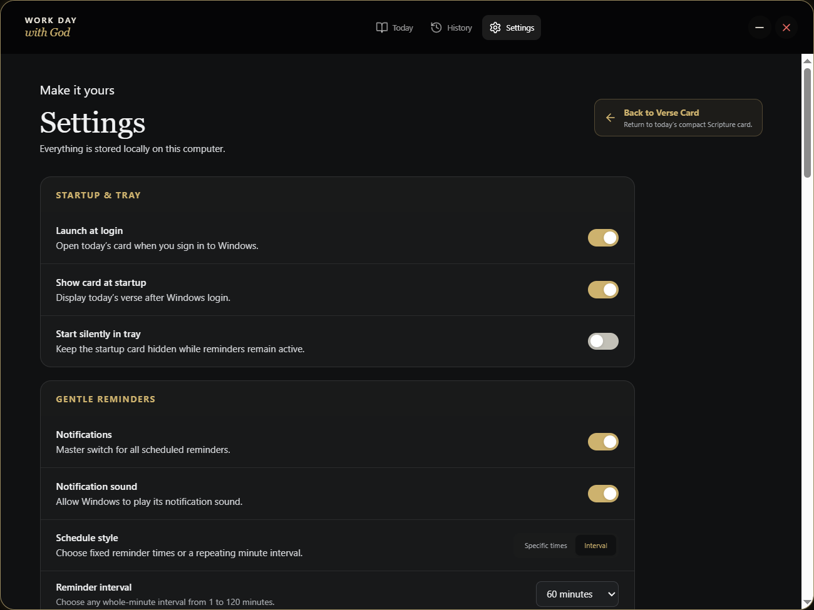</td>
  </tr>
  <tr>
    <td align="center"><strong>Reminder Controls</strong></td>
    <td align="center"><strong>Offline Scripture Library</strong></td>
  </tr>
  <tr>
    <td align="center">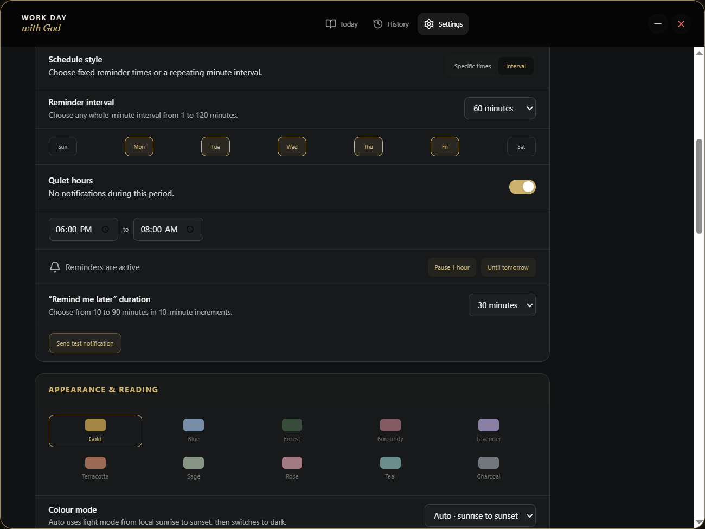</td>
    <td align="center">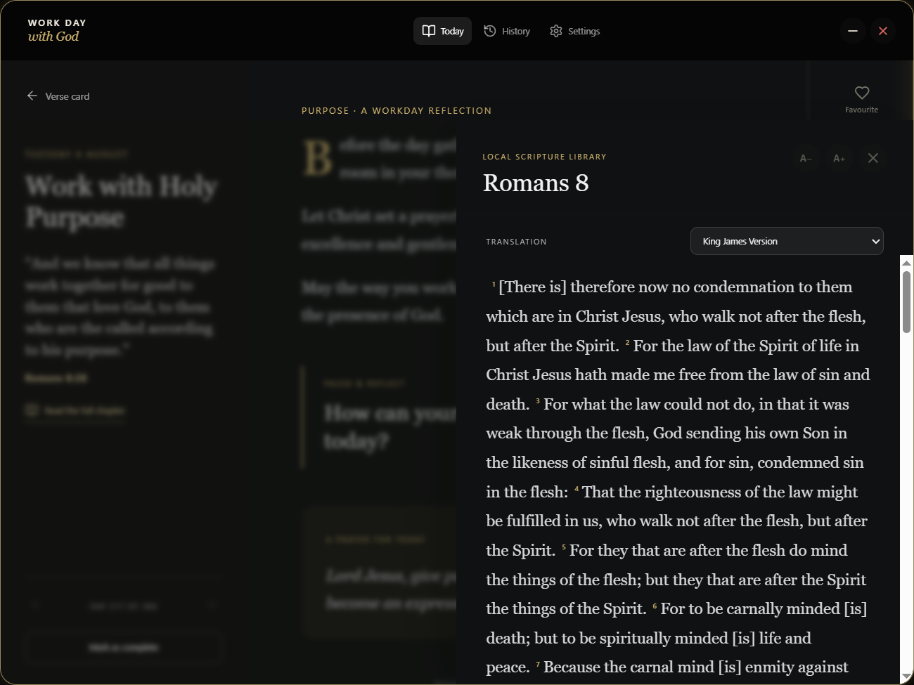</td>
  </tr>
</table>

## What the app offers

- 366 explicitly Christ-centred daily devotionals.
- A unique scenic background for every day
- Encouraging KJV anchor verses, with roughly three quarters drawn from the New Testament and hope-filled pastoral selections from the Old Testament
- Original reflections, practical questions, closing thoughts, and prayers that point readers to Jesus or Christ
- Compact devotional card and expanded reading view
- Full Bible chapter reading in nine bundled translations
- Custom reminder times or repeating reminder intervals
- Editable active weekdays, quiet hours, snooze, and pause controls
- Windows, native Android, and native iOS notifications that open the relevant devotional
- Windows and Android update notifications with platform-specific update actions
- Android Settings actions for Update, Install, and View on GitHub
- Phone UI size adjustment from 85% to 140% for enlarged display settings
- Calendar history, completed readings, favourites, and streak tracking
- Adjustable text size and reading controls
- Automatic sunrise-to-sunset, system, light, and dark modes; colour themes; focus mode; and reduced motion
- Optional launch when signing in to Windows
- System-tray operation with **Open**, **Settings**, and **Quit**
- Automatic daily rollover at midnight
- Complete offline operation after installation

## Designed for a quieter workday

Work Day with God is intended to provide small moments of spiritual stillness without becoming another demanding application. It can open with today’s devotional, remind you at suitable times, and then stay out of the way in the system tray.

On Windows and Linux desktop builds, closing the window does not stop the app. It hides the window in the system tray so scheduled reminders can continue. To close it completely, right-click the tray icon and select **Quit**.

## Free, private, and offline

Work Day with God is completely free for Christians to use.

- No account is required.
- No subscription is required.
- No advertisements are displayed.
- No internet connection is required after installation.
- No personal reading information is sent to a server.
- Settings, favourites, history, streaks, and reminder state remain on your device.

The application stores its local preferences and reading history in private platform-specific application storage. Windows maintains a recovery backup, while Android provides manual JSON backup export and restore through the system document and share interfaces. Android cloud backup is disabled.

## Support and feedback

For application support, feedback, or bug reports, join the official [Work Day with God Discord server](https://discord.gg/2UvdpY4JSW).

Discord is optional and is not required to use Work Day with God. The application remains completely offline after installation, requires no account or subscription, and does not send reading activity to Discord or another remote service.

## Copyright, free use, and licensing

**Work Day with God is provided completely free of charge.** There is no purchase price, subscription fee, advertising charge, or required donation. Everyone may download, install, and use the official application without payment.

Copyright © 2026 Kenneth Salmon / Work Day with God. All rights reserved unless a separate licence or attribution notice explicitly states otherwise.

“Free of charge” describes the cost of using the application; it does not place the project in the public domain or transfer ownership of its source code, devotional writing, branding, interface design, or original artwork. The project and its original materials may not be sold, repackaged, redistributed, modified for redistribution, or presented as another person’s work without prior written permission from the copyright owner.

Bundled Bible translations, open-source software libraries, scenic source materials, and other third-party components remain subject to their respective copyright, public-domain, and licence terms. Further details are available in [Content and Asset Provenance](CONTENT_AND_ASSET_PROVENANCE.md).

The application is provided “as is,” without warranties or guarantees. For permissions or copyright questions, contact [kenneth.salmon87@outlook.com](mailto:kenneth.salmon87@outlook.com).

## Bible translations

The daily devotional quotation remains in the King James Version. The full-chapter reader allows the user to choose from these locally bundled historical translations:

- King James Version
- American Standard Version
- Darby Bible Translation
- Douay-Rheims Bible
- English Revised Version
- JPS 1917
- Webster Bible Translation
- Young’s Literal Translation
- Geneva Bible 1560

## Installing on Windows

The current stable release is **Work Day with God 1.4.9 for Windows x64**. Download `Work-Day-with-God-Setup-1.4.9.exe` from the [latest GitHub release](https://github.com/mcographics/WorkDaywithGod/releases/latest) and run it.

Starting with Windows 1.4.5, Settings can check GitHub for a newer release, open its release page, download a verified installer with visible progress, install it, and relaunch the updated app. This first updater-enabled release must be installed normally; subsequent Windows releases can use **Install Now** when their installer, blockmap, and `latest.yml` are published together.

The current public build is an unsigned, per-user Windows installer. Windows SmartScreen may show an **Unknown publisher** warning. Review the downloaded file and choose **More info** followed by **Run anyway** if you trust the release.

The installer creates a Start Menu shortcut and offers a desktop shortcut. Uninstalling the application preserves personal settings unless those files are removed manually.

## Installing on Android

The current Android release is **Work Day with God 1.0.4** for phones running Android 7.0 or newer. It is a separate release line from Windows 1.4.9. Download `Work-Day-with-God-Android-1.0.4.apk` and its `.sha256` checksum from the [Android 1.0.4 release](https://github.com/mcographics/WorkDaywithGod/releases/tag/android-v1.0.4).

The exact source snapshot used for the Android release is preserved by the [`android-v1.0.4` tag](https://github.com/mcographics/WorkDaywithGod/tree/android-v1.0.4).

### Android app preview

<table>
  <tr>
    <td align="center"><strong>Daily Verse Card</strong></td>
    <td align="center"><strong>Daily Devotional</strong></td>
    <td align="center"><strong>Future Devotionals</strong></td>
  </tr>
  <tr>
    <td align="center">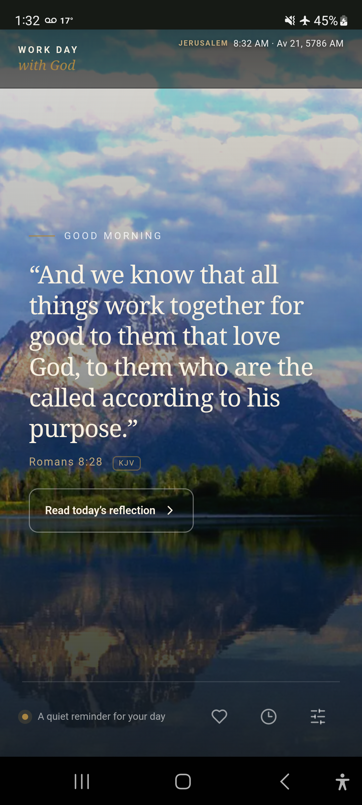</td>
    <td align="center">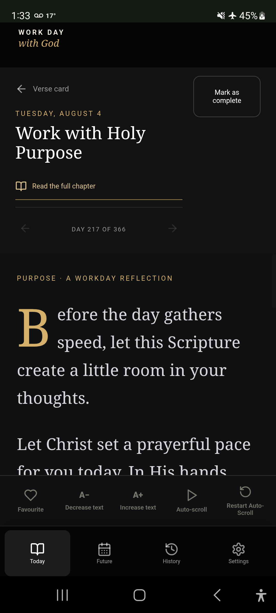</td>
    <td align="center">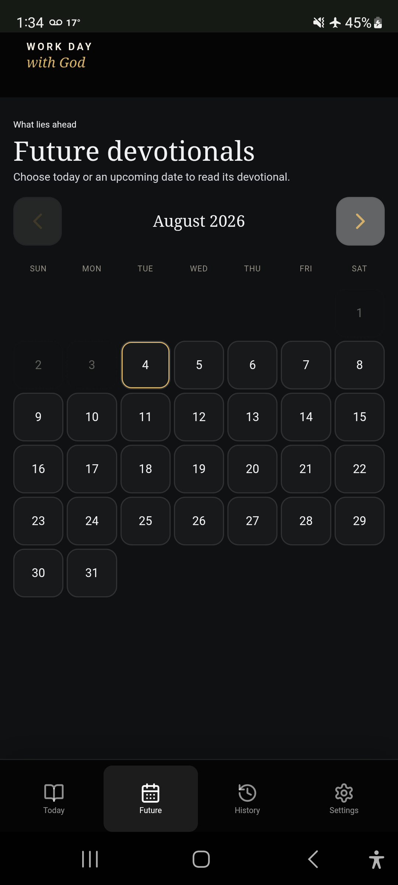</td>
  </tr>
  <tr>
    <td align="center"><strong>Reminder Settings</strong></td>
    <td align="center"><strong>Reminder Controls</strong></td>
    <td align="center"><strong>Offline Scripture Library</strong></td>
  </tr>
  <tr>
    <td align="center">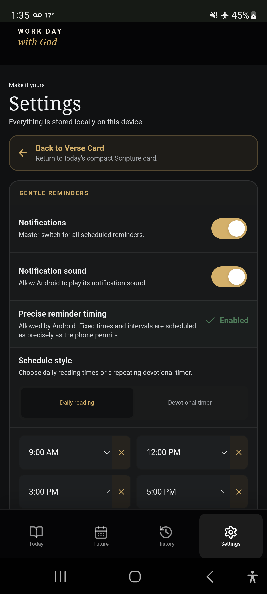</td>
    <td align="center">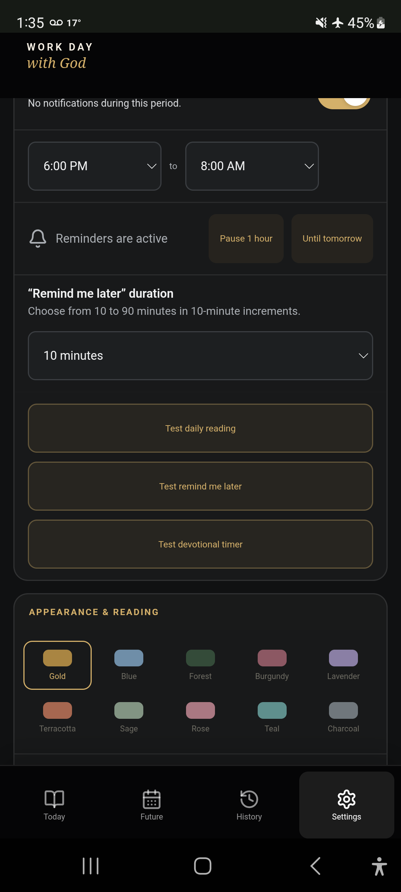</td>
    <td align="center">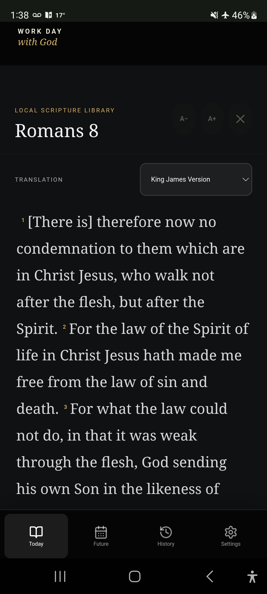</td>
  </tr>
</table>

The Android APK is signed with the project’s dedicated private release key, but it is distributed directly through GitHub rather than Google Play. Android may ask you to allow **Install unknown apps** for the browser or file manager you use to open the APK. That permission can be turned off again after installation.

On Android 13 and newer, allow notification access when prompted if you want devotional reminders. For the most precise delivery, open **Settings → Notifications and reminders → Precise reminder timing** and allow Android’s **Alarms & reminders** access. Android’s battery management can delay inexact reminders when that optional access is not enabled.

Updates can be installed over the existing Android app by opening a newer APK signed by the same Work Day with God release key. Settings, favourites, completion history, and reading positions remain device-local. See the [complete Android guide](docs/ANDROID.md) for installation, permissions, reminders, privacy, backup, troubleshooting, and release-build details.

## Linux testing preview

The current public Linux build is **Work Day with God 1.2.2 for Linux x64**. It remains an experimental testing prerelease and is not part of the stable Windows 1.4.9 or Android 1.0.4 release lines. The next Linux build is prepared in source but awaits a Linux-capable packaging environment.

Download the existing packages from the [`v1.2.2-linux-beta.1` Linux Testing Preview](https://github.com/mcographics/WorkDaywithGod/releases/tag/v1.2.2-linux-beta.1). The exact source used for those packages is preserved separately on the [`linux-v1.2.2-testing` branch](https://github.com/mcographics/WorkDaywithGod/tree/linux-v1.2.2-testing).

Three x64 package formats are available:

- **AppImage** for a portable application that runs across many distributions without installation. Make it executable with `chmod +x` before launching it.
- **DEB** for Debian, Ubuntu, Linux Mint, and other Debian-based distributions.
- **RPM** for Fedora, RHEL, openSUSE, and other RPM-based distributions.

The experimental Linux packages are unsigned. Distribution security policies may display a warning or require the user to confirm installation.

Example installation commands:

```bash
chmod +x Work-Day-with-God-1.2.2-linux-x86_64.AppImage
./Work-Day-with-God-1.2.2-linux-x86_64.AppImage

sudo apt install ./Work-Day-with-God-1.2.2-linux-amd64.deb
sudo dnf install ./Work-Day-with-God-1.2.2-linux-x86_64.rpm
```

Linux testers are encouraged to report the distribution and version, desktop environment, Wayland or X11 session, package format, reproduction steps, screenshots, and relevant terminal output through [GitHub Issues](https://github.com/mcographics/WorkDaywithGod/issues) or the [Discord support server](https://discord.gg/2UvdpY4JSW).

## For developers

Node.js 22.12 or newer is recommended.

```powershell
npm install
npm run content:generate
npm run branding:generate
npm run dev
```

Run the automated checks and production web build:

```powershell
npm test
npm run build
npm audit
```

Create the Windows installer:

```powershell
npm run dist:win
```

For in-app Windows updates, publish all three files produced in `release`: the versioned `.exe`, its `.exe.blockmap`, and `latest.yml`. The app uses `latest.yml` to verify the installer, show download progress in Settings, install the release, and relaunch automatically. If `latest.yml` is omitted from a GitHub release, users can still use **View on GitHub**, but **Install Now** will stop safely instead of installing an unverifiable file.

Create and synchronize the Android project, build an installable debug APK, or build the signed GitHub release APK:

```powershell
npm run android:sync
npm run android:debug
npm run android:release
```

The Android build requires Android SDK Platform 36, Build-Tools 36.0.0, Node.js 22 or newer, and a supported JDK from version 17 through 24. The included PowerShell build helper discovers the standard Android SDK location and a local Temurin 21 installation. A signed release additionally requires the untracked signing-properties file described in the [Android guide](docs/ANDROID.md); private signing material must never be committed.

Synchronize the iOS project after changing shared application code or branding:

```bash
npm run ios:sync
npm run ios:open
```

The checked-in native iOS project uses Swift Package Manager, targets iOS 15 or newer, and is configured as iOS version 1.0.0 with bundle identifier `com.mcographics.workdaywithgod`. Building, simulator testing, device installation, signing, TestFlight, and App Store archiving require macOS with Xcode 26 or newer. See the [iOS guide](docs/IOS.md) for the complete handoff and release procedure.

For experimental testing, Windows developers can create Linux x64 AppImage, DEB, and RPM packages through Docker Desktop’s Linux engine:

```powershell
npm run dist:linux:docker
```

Docker Desktop must be running. The build uses the date-pinned `electronuserland/builder:22-05.26` image and stores reusable dependency caches in Docker volumes. Windows and Linux packages are written to the local `release` directory.

## Content and artwork

The reflections, questions, and prayers are original Work Day with God content. Daily scenic artwork is bundled locally and optimized for offline use. Scripture and artwork details are documented in [CONTENT_AND_ASSET_PROVENANCE.md](CONTENT_AND_ASSET_PROVENANCE.md).

## Current release scope

Work Day with God is intentionally focused on personal daily devotion. It does not include accounts, cloud synchronization, social sharing, community submissions, runtime AI content, advertising, or extensive Bible-study datasets.

---

May Work Day with God help bring Scripture, prayer, and a moment of peace into every working day.
